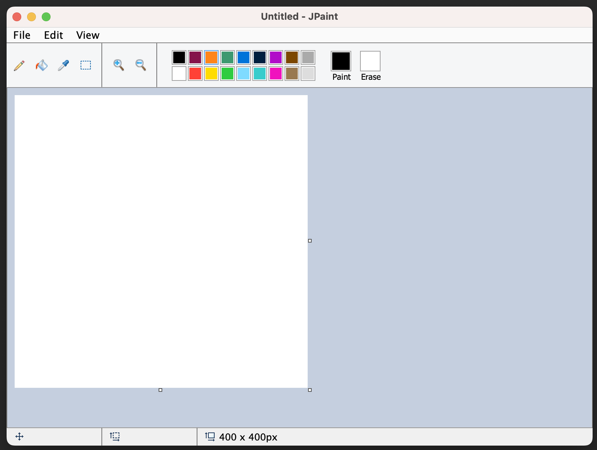

# JPaint

## What is this project?

I really like Microsoft Paint as an image editor.
It's lightweight, easy to use, and I can do the simple things that I often need to do to images both quickly and efficiently.

Time and time again, when using my work-issued Mac computer, I am just always finding situations where I wish I had Microsoft Paint.
The image editing tools for Mac are just kind of annoying and clunky, and it feels like there just isn't a Paint equivalent out there that truly suits my needs.

So I made one.
JPaint, or its unofficial title of Macrosoft Paint, is a Microsoft Paint clone that is written in Java.
Since Java projects can run on any OS, this project's goal is to get a Microsoft Paint equivalent working for MacOS.

## How to run this project?

You should be able to just download and run the JAR file from the latest release on the [Releases](https://github.com/a-r-t/JPaint/releases) page as long as you have Java installed.
I've been developing and testing this app with Java version 17, so I recommend a Java version >= 17 be installed to run this.
I think technically it may be able to work with as low as Java 9 worst case...but once again I do not recommend using the app with a Java version below 17.

You can also clone and run the project yourself.
It does not use any external libraries.
I recommend using IntelliJ IDE, as all you need to do is mark the Resources directly as the "resources root" and the project will run from there.

## Where is progress at?

Right now, the project is in progress, and randomly receives a surge of commits here and there whenever I feel motivated enough.
It is now far enough along that I released a beta.
I have ported over a ton of core Microsoft Paint features, and I even made the thing look like the older version of Paint before Microsoft tried to Zoomer-fy it.
I developed it on a Windows computer, and it works well on Windows from my testing.
However, since the goal is for it to be used on MacOS, I have released this beta to let others test it out for me on their Mac computers and let me know of any bugs/oddities before I move into an official version 1 release.
I have tested on my Mac computer and things seem fine so far after fixing a ton of random bugs I came across -- I'm sure there are more that haven't been found yet that will be discovered once the app gets used more.

The application currently supports the following features from Paint:
- Pencil Tool
- Eye Dropper Tool
- Bucket Tool
- Rectangle Select Tool (selecting sub image, moving sub image around, etc.)
- Zoom In/Out
- Resize Canvas
- Select Colors (preset and custom)
- Cut/Copy/Paste sub images
- Paste external images in from clipboard
- Undo and Redo system
- Open existing files
- Save files

## How do I use this project?

If you know how to use Microsoft Paint, you should be able to jump right into this project no problem and edit images.
I recommend that you use an external mouse instead of a trackpad if on a laptop.

Here are some tips:

### Pencil Tool

Pencil tool allows for free-hand drawing. 
Hold left-click down to draw in the selected paint color.
Hold right-click down to draw in the selected erase color.

Hold shift to force drawing in a straight line.
Works either horizontally or vertically based on the direction the mouse is first dragged in while shift key is held.

### Bucket Tool

Left-click to spread a chosen color with the selected paint color.
Right-click does the same, but with the erase color.

### Eye Dropper Tool

Left-click a pixel on the canvas to change the paint color to the selected color.
Right-click does the same, but changes teh erase color instead.

### Rectangle Select Tool

Hold left-click to drag a box around a piece of an image.
Afterwards, you can hover over the selected sub image, click on it, and drag it around.
Arrow keys can be used to move sub image as well for greater precision.

While a sub image is selected, it can be cut or copied to the clipboard.

When pasting an image into the canvas, it will automatically be wrapped in a rectangle select box as a sub image.

Press both ctrl (or command on MacOS) and A to select entire image as sub image.

### Zoom In/Out

Click one of the zoom in or zoom out icons to scale the canvas.
Often times it is required to zoom in pretty close for detailed pixel art.

Holding ctrl (or command on MacOS) and spinning the mouse wheel is a shortcut for clicking the zoom in and zoom out buttons.

### Resize Canvas

Hovering over and clicking on one of the three dots on the east/south side of the canvas will allow you to grow/shrink the canvas.

There is also a menu option for resizing the canvas where a desired width and height can be submitted for greater precision.

### Select Colors

Left-clicking on one of the preset colors will change the paint color to the chosen color.
Right-clicking one of the preset colors does the same, but changes the erase-color.

Holding ctrl (or command on MacOS) and clicking a preset color will open up the color picker and allow you to select a custom color using RGB values.
This custom color will then replace the original preset color.

Double clicking on the paint or erase color display swatch will also open up the color picker and allow you to select a custom color using RGB values.
This custom color will then replace the original paint/erase color based on which one was chosen.

## Can others request features or contribute?

Sure, feel free to fork this, or put an issue in the repo to bring feature requests or bug reports to my attention.